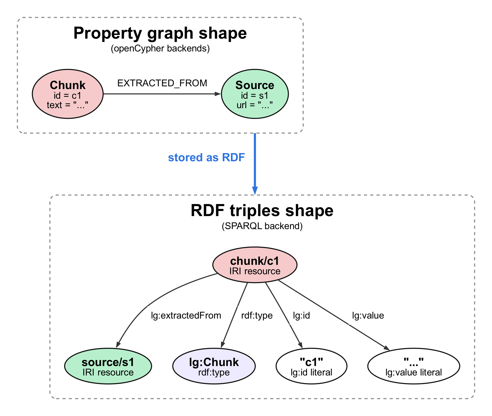

### Topics

  - [Overview](#overview)
  - [Install package](#install-package)
  - [Registering the RDF / SPARQL graph store](#registering-the-rdf--sparql-graph-store)
  - [Creating an RDF / SPARQL graph store](#creating-an-rdf--sparql-graph-store)
    - [Connection string schemes](#connection-string-schemes)
    - [Separate query and update endpoints](#separate-query-and-update-endpoints)
    - [Credentials and headers](#credentials-and-headers)
    - [Namespace and prefix configuration](#namespace-and-prefix-configuration)
  - [RDF model mapping](#rdf-model-mapping)
    - [Fact-centric statements](#fact-centric-statements)

### Overview

You can use an RDF graph store that exposes SPARQL 1.1 query and update endpoints as a graph store.

The other graph-store backends in this section are labeled property graphs queried with openCypher. The RDF / SPARQL backend stores the same lexical graph as RDF triples. Build-path writes are translated to SPARQL updates, and retriever reads run against SPARQL templates.

The backend targets endpoints that accept form-encoded `query=` / `update=` requests and return SPARQL JSON for `SELECT` and `ASK` results.

### Install package

The RDF / SPARQL graph store is contained in a separate contributor package. To install it:

```
!pip install https://github.com/awslabs/graphrag-toolkit/archive/refs/heads/main.zip#subdirectory=lexical-graph-contrib/sparql
```

### Registering the RDF / SPARQL graph store

Before creating an RDF / SPARQL graph store, you must register the `SPARQLGraphStoreFactory` with the `GraphStoreFactory`:

```python
from graphrag_toolkit.lexical_graph.storage import GraphStoreFactory
from graphrag_toolkit_contrib.lexical_graph.storage.graph.sparql import SPARQLGraphStoreFactory

GraphStoreFactory.register(SPARQLGraphStoreFactory)
```

### Creating an RDF / SPARQL graph store

Use the `GraphStoreFactory.for_graph_store()` static factory method to create an instance of an RDF / SPARQL graph store.

To create an RDF / SPARQL graph store, supply a connection string that begins with a `sparql` scheme and points to the endpoint's query URL:

```python
graph_store = GraphStoreFactory.for_graph_store(
    'sparql+https://example.test/sparql/query',
    update_endpoint='https://example.test/sparql/update',
)
```

The RDF / SPARQL graph store connects to an existing endpoint. It does not create the repository or dataset.

The RDF / SPARQL graph store currently supports lexical-graph build writes with local entities and versioning disabled, and the read templates used by the default traversal-based retrieval path. It does not translate arbitrary Cypher; unsupported reads raise `UnsupportedReadError`, and unsupported writes raise `UnsupportedWriteError`.

Leave `INCLUDE_LOCAL_ENTITIES` and [versioned updates](/graphrag-toolkit/lexical-graph/versioned-updates/) disabled. These are the defaults. Administrative and lifecycle operations such as `get_stats()`, `get_sources()`, `delete_sources()` and runtime graph-summary reads are not implemented. Tenant writes use tenant named graphs, but tenant reads are not scoped by the backend yet; use a single-tenant dataset setup unless your endpoint exposes the tenant graph in the default dataset.

#### Connection string schemes

The scheme selects the transport and is stripped before the request is sent.

<table>
  <thead>
    <tr>
      <th>Scheme</th>
      <th>Endpoint URL produced</th>
    </tr>
  </thead>
  <tbody>
    <tr>
      <td><code>sparql://host/path</code></td>
      <td><code>http://host/path</code></td>
    </tr>
    <tr>
      <td><code>sparql+s://host/path</code></td>
      <td><code>https://host/path</code></td>
    </tr>
    <tr>
      <td><code>sparql+http://host/path</code></td>
      <td><code>http://host/path</code></td>
    </tr>
    <tr>
      <td><code>sparql+https://host/path</code></td>
      <td><code>https://host/path</code></td>
    </tr>
  </tbody>
</table>

#### Separate query and update endpoints

Some RDF stores serve reads and writes from one URL; others split them. Pass `update_endpoint` when the update URL differs from the query URL.

You can also pass the update URL with an `update_endpoint` query parameter in the connection string. If no update endpoint is supplied, the query endpoint is used for both reads and writes.

For example, GraphDB uses `/repositories/{repository-id}` for queries and `/repositories/{repository-id}/statements` for updates. Supply those as the connection URL and `update_endpoint`, respectively.

#### Credentials and headers

Credentials can be supplied in the connection string, with `username` / `password` keyword arguments, or with the `SPARQL_USER` / `SPARQL_PASSWORD` environment variables.

Extra HTTP headers can be passed with `headers={...}`.

#### Namespace and prefix configuration

The RDF model uses one namespace for schema terms and one namespace for instance IRIs. These values can be changed when creating the graph store.

<table>
  <thead>
    <tr>
      <th>Kwarg</th>
      <th>Default</th>
      <th>Purpose</th>
    </tr>
  </thead>
  <tbody>
    <tr>
      <td><code>lexical_prefix</code></td>
      <td><code>lg</code></td>
      <td>Prefix emitted in generated SPARQL templates</td>
    </tr>
    <tr>
      <td><code>lexical_schema_namespace</code></td>
      <td><code>https://awslabs.github.io/graphrag-toolkit/lexical#</code></td>
      <td>Classes and predicates such as <code>lg:Entity</code> and <code>lg:predicate</code></td>
    </tr>
    <tr>
      <td><code>lexical_instance_namespace</code></td>
      <td><code>https://awslabs.github.io/graphrag-toolkit/lexical/</code></td>
      <td>Instance IRIs for sources, chunks, entities, facts, relation nodes, and tenant named graphs</td>
    </tr>
    <tr>
      <td><code>sparql_prefixes</code></td>
      <td><code>&#123;&#125;</code></td>
      <td>Additional prefixes included in generated read queries</td>
    </tr>
  </tbody>
</table>

For example:

```python
graph_store = GraphStoreFactory.for_graph_store(
    'sparql+https://example.test/sparql/query',
    update_endpoint='https://example.test/sparql/update',
    lexical_prefix='gt',
    lexical_schema_namespace='https://example.com/graphrag/schema#',
    lexical_instance_namespace='https://example.com/graphrag/data/',
    sparql_prefixes={'xsd': 'http://www.w3.org/2001/XMLSchema#'},
)
```

Changing namespaces changes the IRIs written for new data. Use one namespace configuration per repository unless you are intentionally migrating data.

### RDF model mapping

The lexical graph model does not change. Sources, chunks, topics, statements, facts and entities are still the domain objects. What changes is the storage shape.



Nodes become IRIs. A node label becomes an `rdf:type`, the original id is stored as `lg:id`, and node properties become RDF literals.

Edges without properties become predicates. For example, `__EXTRACTED_FROM__` becomes `lg:extractedFrom`, and `__SUPPORTS__` becomes `lg:supports`.

Some property-graph edge types are split into more specific RDF predicates where the source and target types differ. For example, `__MENTIONED_IN__` maps to `lg:statementMentionedIn` or `lg:topicMentionedIn`.

The full class and predicate mapping is in the [SPARQL contributor README](https://github.com/awslabs/graphrag-toolkit/blob/main/lexical-graph-contrib/sparql/README.md).

#### Fact-centric statements

The property graph represents an extracted relationship with a `Fact` node, subject/object edges and a separate `RELATION` edge. In RDF, the Fact itself records the subject, predicate and object.

```turtle
<fact/f1> a lg:Fact ;
    lg:subject <entity/amazon> ;
    lg:predicate <relation/produces> ;
    lg:object <entity/ec2> ;
    lg:supports <statement/s1> ;
    lg:value "Amazon PRODUCES EC2" .

<relation/produces> a lg:Relation ;
    lg:value "PRODUCES" .
```


Entity subjects and objects are stored as IRIs. Local subjects and complement objects are stored as literals when local entities are disabled. Predicate values point to shared `lg:Relation` resources, so repeated predicates reuse one registry entry. No separate per-fact relation resource or duplicate direct entity edge is written.

This is a lexical-graph-specific statement model, not W3C RDF reification with `rdf:Statement`, `rdf:subject`, `rdf:predicate` and `rdf:object`. Class-level `SYS_RELATION` edges remain `lg:SysRelation` resources because they carry count metadata.

Reads traverse `lg:subject` and `lg:object` through Facts so retrievers still receive openCypher-shaped results.
