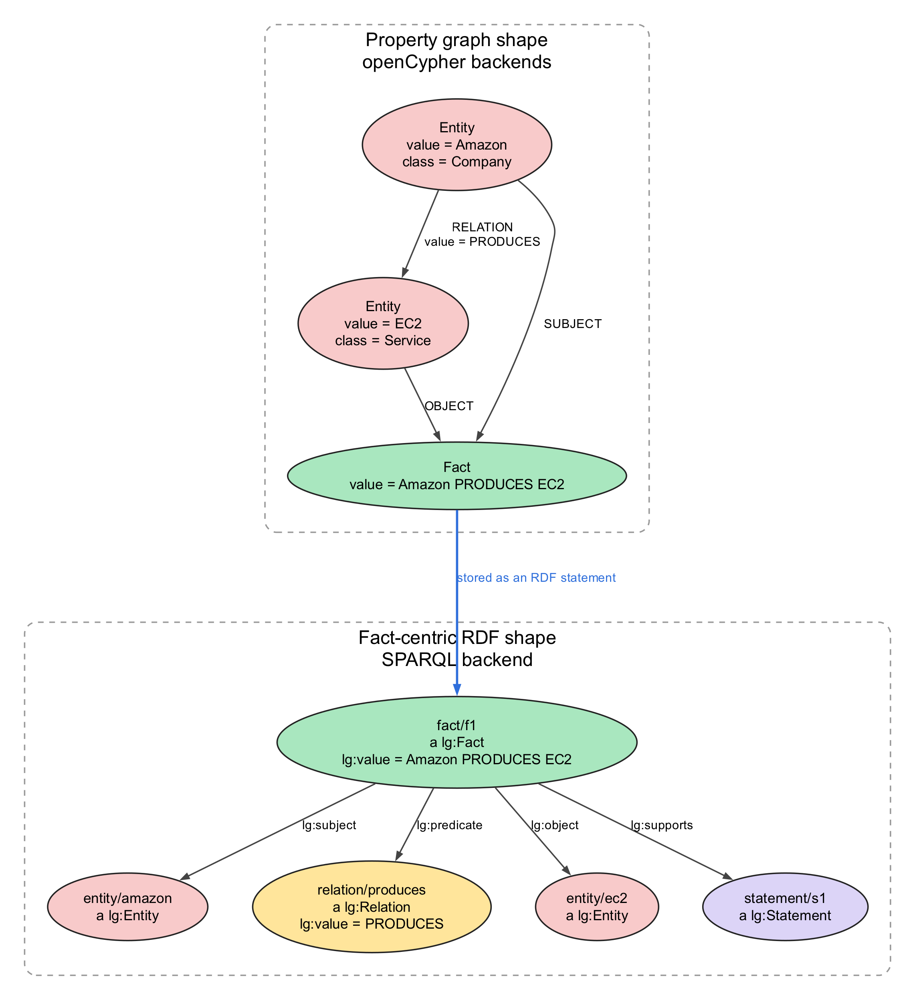

# graphrag-toolkit-lexical-graph-sparql

RDF/SPARQL support for the AWS GraphRAG Toolkit lexical graph.

`SPARQLGraphStoreFactory` / `SPARQLDatabaseClient` target SPARQL 1.1 query and
update endpoints that support form-encoded `query=` / `update=` requests and
return SELECT/ASK results as SPARQL JSON.

Unlike the other backends (Neo4j, Neptune, FalkorDB) which are all Labeled
Property Graph / OpenCypher engines, this backend stores the lexical graph as
RDF triples and answers the toolkit's OpenCypher operations with SPARQL at the
storage boundary:

* Build-path writes (`MERGE`/`SET` from the graph builders) become SPARQL
  updates.
* Retriever reads (`MATCH ... RETURN`) become hand-authored SPARQL templates.

## Usage

```python
from graphrag_toolkit.lexical_graph.storage import GraphStoreFactory
from graphrag_toolkit_contrib.lexical_graph.storage.graph.sparql import SPARQLGraphStoreFactory

GraphStoreFactory.register(SPARQLGraphStoreFactory)

graph_store = GraphStoreFactory.for_graph_store(
    'sparql+https://example.test/sparql/query',
    update_endpoint='https://example.test/sparql/update',
)
```

Supported generic schemes:

| Scheme | Endpoint URL produced |
|---|---|
| `sparql://host/path` | `http://host/path` |
| `sparql+s://host/path` | `https://host/path` |
| `sparql+http://host/path` | `http://host/path` |
| `sparql+https://host/path` | `https://host/path` |

Use `update_endpoint` when the store has separate query and update URLs. If it
is omitted, the query endpoint is used for both reads and writes.

For example, GraphDB uses `/repositories/{repository-id}` for queries and
`/repositories/{repository-id}/statements` for updates. Supply those as the
connection URL and `update_endpoint`, respectively.

Credentials may be supplied in the connection string, via `username`/`password`
kwargs, or through `SPARQL_USER` / `SPARQL_PASSWORD`. Extra HTTP headers can be
passed with `headers={...}`.

## Namespace Configuration

The RDF model uses two namespaces:

| Kwarg | Default | Purpose |
|---|---|---|
| `lexical_prefix` | `lg` | Prefix emitted in SPARQL read templates |
| `lexical_schema_namespace` | `https://awslabs.github.io/graphrag-toolkit/lexical#` | Classes and predicates such as `lg:Entity` and `lg:predicate` |
| `lexical_instance_namespace` | `https://awslabs.github.io/graphrag-toolkit/lexical/` | Instance IRIs for sources, chunks, entities, facts, relation nodes, and tenant named graphs |
| `sparql_prefixes` | `{}` | Additional prefixes included in generated read queries |

Example:

```python
graph_store = GraphStoreFactory.for_graph_store(
    'sparql+https://example.test/sparql/query',
    update_endpoint='https://example.test/sparql/update',
    lexical_prefix='gt',
    lexical_schema_namespace='https://example.com/graphrag/schema#',
    lexical_instance_namespace='https://example.com/graphrag/data/',
    sparql_prefixes={'xsd': 'http://www.w3.org/2001/XMLSchema#'},
)
```

Changing namespaces changes the IRIs written for new data. Use one namespace
configuration per repository unless you are intentionally migrating data.

## RDF Model

The lexical graph is the same on every backend — the same sources, chunks,
topics, statements, facts and entities described in the
[graph model](https://awslabs.github.io/graphrag-toolkit/lexical-graph/graph-model/).
What changes here is how it's written down. A property graph and a set of RDF
triples record the same thing in different shapes, and the move from one to the
other happens in three steps:

1. **Nodes become IRIs.** Each node is a deterministic IRI derived from its
   existing id. Its LPG label becomes an `rdf:type` (an RDF class), and the raw
   id is kept as an `lg:id` literal so reads can match on it. Node properties
   become plain triples.
2. **Edges become predicates.** An edge with no properties of its own is just a
   link between two nodes, so it maps straight to a predicate.
3. **Facts encode extracted relationships.** Each `lg:Fact` identifies its
   subject, predicate and object directly. The LPG `__RELATION__` edge is not
   stored as a second per-fact resource.

| LPG label | RDF class |
|---|---|
| `__Source__` | `lg:Source` |
| `__Chunk__` | `lg:Chunk` |
| `__Topic__` | `lg:Topic` |
| `__Statement__` | `lg:Statement` |
| `__Fact__` | `lg:Fact` |
| `__Entity__` | `lg:Entity` |
| `__SYS_Class__` | `lg:SysClass` |

| LPG edge | RDF predicate |
|---|---|
| `__EXTRACTED_FROM__` | `lg:extractedFrom` |
| `__PARENT__`/`__CHILD__`/`__NEXT__` | `lg:parent`/`lg:child`/`lg:next` |
| Chunk `__PREVIOUS__` | `lg:chunkPrevious` |
| Statement `__PREVIOUS__` | `lg:statementPrevious` |
| Topic `__MENTIONED_IN__` | `lg:topicMentionedIn` |
| Statement `__MENTIONED_IN__` | `lg:statementMentionedIn` |
| `__BELONGS_TO__` | `lg:belongsTo` |
| `__SUPPORTS__` | `lg:supports` |
| `__SUBJECT__`/`__OBJECT__` | `lg:Fact` -> `lg:subject`/`lg:object` -> entity IRI or literal |

### Fact-centric statement model

The property graph represents an extracted relationship with a `__Fact__` node,
subject/object edges and a separate `__RELATION__` edge. In RDF, the Fact itself
is the statement resource:

```turtle
<fact/f1> a lg:Fact ;
    lg:subject <entity/amazon> ;
    lg:predicate <relation/produces> ;
    lg:object <entity/ec2> ;
    lg:supports <statement/s1> ;
    lg:value "Amazon PRODUCES EC2" .

<relation/produces> a lg:Relation ;
    lg:value "PRODUCES" .
```



Entity subjects and objects are stored as IRIs. Local subjects and complement
objects are stored as literals when local entities are disabled. Predicate
values point to shared `lg:Relation` resources, normalised by value, so repeated
predicates reuse one registry entry.

This is a lexical-graph-specific statement model, not W3C RDF reification with
`rdf:Statement`, `rdf:subject`, `rdf:predicate` and `rdf:object`. Class-level
`__SYS_RELATION__{value,count}` edges remain `lg:SysRelation` resources because
their count is metadata about the class relationship.

Reads traverse `lg:subject` and `lg:object` through Facts to reproduce the
property-graph relationships expected by the toolkit.

Domain-ambiguous edges use specialised predicates with single domain/range
intent, for example `lg:statementMentionedIn` / `lg:topicMentionedIn` and
`lg:chunkPrevious` / `lg:statementPrevious`.

## Current behavior

* Write path: implemented for the build-path patterns used by the lexical graph
  builders when local entities and versioning are disabled.
* Read path: implemented for the default traversal-based retrieval path and
  selected custom traversal reads. An unimplemented read raises
  `UnsupportedReadError` rather than returning wrong results.
* Generic SPARQL store creation does not create repositories. Create the target
  repository in your triple store before building the lexical graph.
* Versioned update maintenance and previous-version deletion are not
  implemented. Keep versioning disabled when using this backend.
* Administrative and lifecycle operations such as `get_stats()`, `get_sources()`,
  `delete_sources()` and runtime graph-summary reads are not implemented.
* Named-tenant writes use tenant named graphs. Read templates currently query the
  endpoint's default dataset, so tenant reads require endpoint dataset
  configuration that exposes the tenant graph until read-side graph scoping is
  implemented.
* Local-entity rewrites are not yet supported; run with
  `INCLUDE_LOCAL_ENTITIES=False`.

## Tests

```bash
pytest lexical-graph-contrib/sparql/tests/test_cypher_to_sparql_write.py -v
pytest lexical-graph-contrib/sparql/tests/test_sparql_templates.py -v
pytest lexical-graph-contrib/sparql/tests/test_sparql_endpoint_client.py -v
pytest lexical-graph-contrib/sparql/tests/test_sparql_graph_store.py -v
pytest lexical-graph-contrib/sparql/tests/test_sparql_graph_store_factory.py -v
pytest lexical-graph-contrib/sparql/tests/test_ontology.py -v
```
